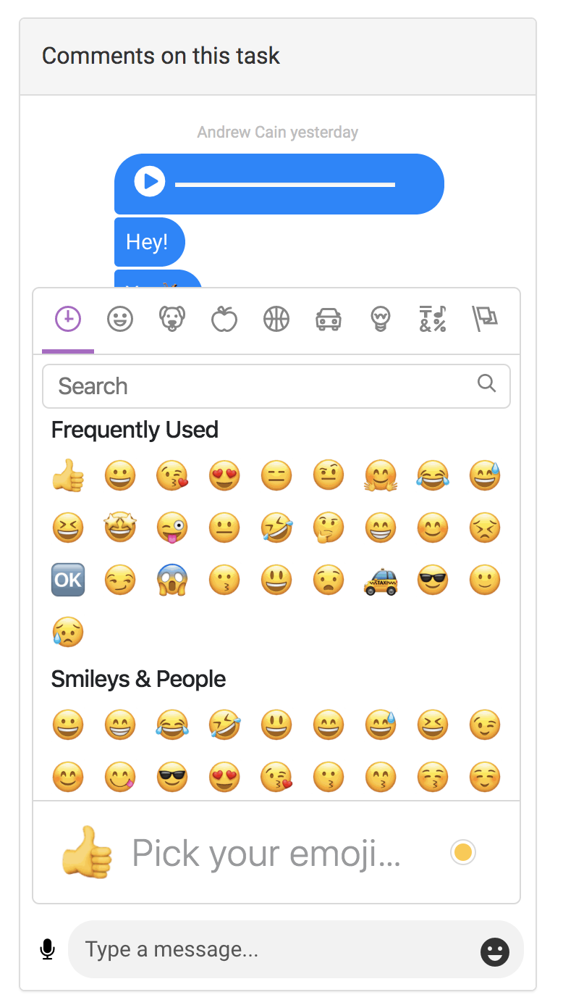
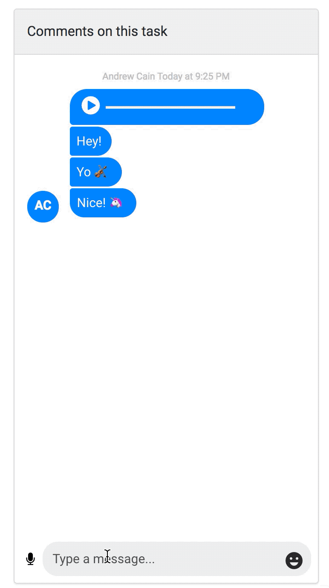

I have wanted to build an extensive, and user-friendly Emoji picker into [Doubtfire](https://github.com/doubtfire-lms) for a long time, so that our students and teachers can easily search for, and send emoji to each other. Here's how I did it.

Firstly, we're not _building_ and entire emoji picker system, just _integrating_ one into an existing chat element. While this may seem like a task unworthy of a blog post, the real challenge was developing a slack-like colon emojis search system using this library.

Final products:



We're starting off by using the awesome Angular emoji picker library developed by [ngx-emoji-mart](https://github.com/TypeCtrl/ngx-emoji-mart#headless-search)

```
npm install @ctrl/ngx-emoji-mart
```

Once installed and modules imported (read the GitHub README for details) it's fairly straight forward to have a nice emoji search button which will toggle the element:

```html
<emoji-mart
  [hidden]="!this.showEmojiPicker"
  class="emoji-picker"
  title="Pick your emoji…"
  emoji="thumbsup"
  (emojiClick)="addEmoji($event)"
></emoji-mart>
```

We have bound the `hidden` attribute to a boolean (declared in the ts file), and the html declaration simply toggles the property:

```html
<div id="textFieldContainer">
  <div
    #commentInput
    id="textField"
    [contenteditable]="contentEditableValue()"
    (keydown.enter)="send($event)"
    (keydown)="keyTyped($event)"
    placeholder="Type a message..."
    name="commentComposer"
  ></div>
  <div id="innerButtons">
    <mat-icon
      id="emojiButton"
      (click)="this.showEmojiPicker = !this.showEmojiPicker"
      aria-hidden="false"
      aria-label="Emoji picker button"
      >emoji_emotions</mat-icon
    >
  </div>
</div>
```

You can see the mat-icon when clicked will toggle the showEmojiPicker boolean.

The final part of this puzzle is to insert the selected emoji into the input/contenteditable field. The hand `(emojiClick)="addEmoji($event)"` nicely handles this for us. Our method simple injects the emoji from the event into our string, something like:

```html
addEmoji(e: Event) { this.input.first.nativeElement.innerText += e.emoji.native
}
```

---

You will need to style and place the element according to your environment, but really, you could stop here. This level of integration alone will introduce a nice way for users to search and input emojis into your input fields, however the real meat of this post is to introduce a Slack-like colon selector system for the headless emoji search.

I am sure there are many, many better ways of achieving this, but at a cursory glance I could not find much... it would be great to see Slack's implementation. So how do we do this?

At first glance this might not seem difficult, you wait until the user types `:` into your app and pop up the emoji list right? But how do you know which text to use as the search term? "Just split the string from the `:` character I hear you say". Well, what if there are multiple `:`s in the text? and what if the user is actually typing code into your markdown editor and the last thing they want to see is an emoji selector? Or what if the user pastes in a pre-written selection of text which includes multiple `:`s!? You might be getting a sense of some of the things we need to consider.

Note: our chat-input element is actually a content-editable div. There are many benefits for using a div over a traditional input field if you're looking to heavily customise the behaviour.

So getting started, the first thing we need to do is start watching for any key press in the input field:

```html
<div
  #commentInput
  id="textField"
  [contenteditable]="contentEditableValue()"
  (keydown.enter)="send($event)"
  (keydown)="keyTyped($event)"
  placeholder="Type a message..."
  name="commentComposer"
></div>
```

Any time a key is pressed down in the field, the keyTyped method will fire, and here's where things start to get... involved.

How I solved this is problem was to search for a substring from the entire input text, from the position of the caret (cursor), back to the first colon character `:` that is found.

~[](./emoji-diagram.png)

The following is the method for doing this, and I have described most of the key lines:

```ts
keyTyped(e: KeyboardEvent) {
  setTimeout(() => {
    // Get the text from the html element
    const commentText: string = this.input.first.nativeElement.innerText;
    // Check if we are in an emoji-input state. Note we simply don't support the emoji selector if the ` character is anywhere in the input, as this may indicate that the user is trying to write code.
    this.emojiSearchMode = !commentText.includes('`') && this.emojiRegex.test(commentText);

    if (this.emojiSearchMode) {
      // get the cursor position in the content-editable
      const cursorPosition = this.caretOffset();

      // get the text from the start of the string up to the cursor.
      const testText = commentText.slice(0, cursorPosition);

      // within this substring, find the last previous `:`
      const lastColPos = testText.lastIndexOf(':');

      // The emoji search term will be from the position after the last :
      // Note, the second parameter is a length not position, so we subtract.
      this.emojiMatch = testText.substr(lastColPos + 1, cursorPosition - lastColPos);

      // Now we can just search the emoji module for the results. We reverse so that the closest match is shown closer to the input field (it will make more sense soon).
      let results = this.emojiSearch.search(this.emojiMatch);
      if (results?.length > 0) {
        this.emojiSearchResults = results.slice(0, 5).reverse();
      }
    } // we timeout 0 to ensure that the innerhtml is updated with the new character.
  }, 0);
}
```
The entire functionality is in a 0 duration timeout as it's enough to ensure that the most recent character is processed and in the innerText.

The method above uses a regular expression to determine if it should be searching for emojis, here are the related emoji properties used in the component:

```ts
  showEmojiPicker: boolean = false;
  emojiSearchMode: boolean = false;
  emojiRegex: RegExp = /(?:\:)(.*?)(?=\:|$)/;
  emojiSearchResults: EmojiData[] = [];
  emojiMatch: string;
```

Note: `/(?:\:)(.*?)(?=\:|$)/` is a regular expression which matches the content after a `:` and before a `:` or the end of a line.

Here is the method for finding the caretOffset (thanks to stack-overflow for this one, although I couldn't find the exact author.)
```ts
private caretOffset() {
    let element = this.input.first.nativeElement;
    let caretOffset: number = 0;
    let doc = element.ownerDocument || element.document;
    let win = doc.defaultView || doc.parentWindow;
    let sel;
    if (typeof win.getSelection !== 'undefined') {
      sel = win.getSelection();
      if (sel.rangeCount > 0) {
        let range = win.getSelection().getRangeAt(0);
        let preCaretRange = range.cloneRange();
        preCaretRange.selectNodeContents(element);
        preCaretRange.setEnd(range.endContainer, range.endOffset);
        caretOffset = preCaretRange.toString().length;
      }
    } else if ((sel = doc.selection) && sel.type !== 'Control') {
      let textRange = sel.createRange();
      let preCaretTextRange = doc.body.createTextRange();
      preCaretTextRange.moveToElementText(element);
      preCaretTextRange.setEndPoint('EndToEnd', textRange);
      caretOffset = preCaretTextRange.text.length;
    }
    return caretOffset;
  }
```

The final part of the javascript puzzle is inserting the emoji into the text at the correct position. At first I was simply appending the emoji, but I found that if the user were to write a message and want to add an emoji previously, it would fail. Here we will use the most recent match preceded by a colon as the replacement substring condition:

```ts
emojiSelected(emoji: string) {
  this.input.first.nativeElement.innerText = this.input.first.nativeElement.innerText.replace(`:${this.emojiMatch}`, emoji);
  this.emojiSearchMode = false;
}
```

The last thing we need to do is get the selected emoji into the DOM. For this, we will use a mat-action-list, binding to the `emojiSearchResults` array. The reversal of the array puts the closest results to the search term at the bottom of the list (closer to the input field).

```html
<mat-action-list [hidden]="!emojiSearchMode" dense id="emojiSearchResults">
  <mat-list-item
    *ngFor="let emoji of emojiSearchResults"
    (click)="emojiSelected(emoji.native)"
  >
    {{emoji.native}} {{emoji.colons}}
  </mat-list-item>
</mat-action-list>
```

Add some styling and we're done!
Final product: 

The full source code for these components can be found on the [Doubtfire repo](https://github.com/jakerenzella/doubtfire-web/tree/enhance/add-emoji/src/app/tasks/task-comment-composer).
